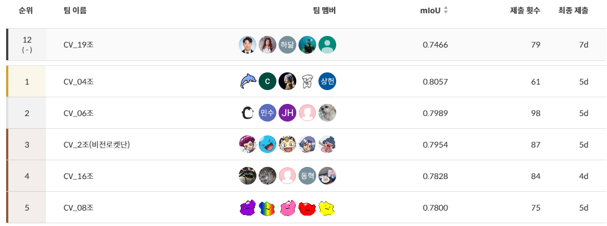
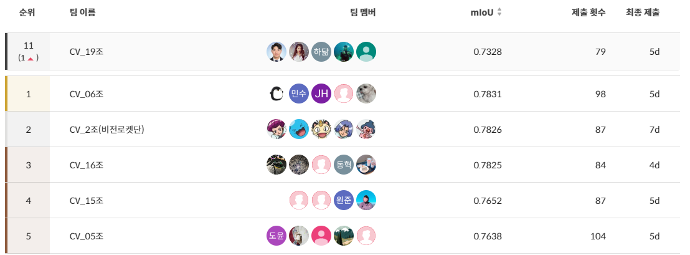

# 재활용 품목 분류를 위한 Semantic Segmentation

Naver BoostCamp AI Tech 4기 CV-19조 Semantic Segmentation 프로젝트

**🏅리더보드(public) 12위/19팀중**

**🏅리더보드(Private) 11위/19팀중**

## 1. 프로젝트 개요

### 📙 프로젝트 주제 

- 이미지 상의 쓰레기를 Segmentation 하는 모델을 통한 **재활용품 클래스**에 해당하는 픽셀을 클래스번호로 마스킹하여 GT와의 mIoU를 평가

- 📆 **대회 기간** : 2022.12.21 ~ 2023.01.06 

- 🛠 **개발 환경**
  - 개발 환경 : VSCode, Jupyter Notebook, GPU(Tesla V100)
  - 협업 Tools : GitHub, Notion, Zoom

## 2.  팀원 소개 

<table>
  <tr>
    <td align="center"><a href="https://github.com/zergswim"> <b>박민규 </b></a> </td>
    <td align="center"><a href="https://github.com/RADM90"> <b>박제원 </b></a> </td>
    <td align="center"><a href="https://github.com/hdak95"> <b>백하닮 </b></a> </td>
    <td align="center"><a href="https://github.com/JunghoYoo"> <b>유정호 </b></a> </td>
    <td align="center"><a href="https://github.com/ths3847"> <b>서성관 </b></a> </td>
    </tr>
</table>

### 👨‍👨‍👦‍👦 팀원 역할

|  팀원  |                       역할                        |
| :----: |:-----------------------------------------------:|
| 박민규 |SMP, 기본 모델 테스트|
| 박제원 |Baseline 모델 및 UPerNet+SwinL 실험, DenseCRF 구현|
| 백하닮 |UPerNet+ConvNeXt, K-Net+SwinL 실험|
| 유정호 |EVA, Mask2Former+ViT-Adapter 실험|
| 서성관 |HRNet+OCR, BEiT+UPerNet 실험|

## 3. Project 

### 📌 Process

1. Problem Definition

   > 10개 + 1개(배경)의 CLASS로 구분된 재활용품 MASK에 대해 각 픽셀별 CLASS를 검출하는 모델 구현하고 mIoU로 성능 평가
   
   **Input :** 쓰레기 객체가 담긴 이미지와 Segmentation Annotation(각 픽셀별 클래스) (COCO Format) 
   **Output :** Pixel 좌표에 따라 카테고리 값을 리턴 (Submission 양식에 맞게 CSV파일 작성)

2. EDA를 통한 Data Cleaning
- 학습/검증 데이터셋이 가지는 특징들(Mislabeled Data 등)이 테스트 데이터셋에도 동일하게 적용되어 있을 것이라 예상, 고의적으로 모델이 노이즈에 노출될 수 있도록 데이터 클리닝을 진행하지 않음

3. Modeling
- `UPerNet SwinL`: Public 0.7499 / Private 0.7293
- `KNet s3 + UPerNet SwinL`: Public 0.6986 / Private 0.6915
- `UPerNet ConvNeXt xlarge`: Public 0.6962 / Private 0.7001
- `Mask2Former + BEiT Adapter`: Public 0.6722 / Private 0.6799

4. Post-processing
- 픽셀 단위의 정교한 Segmentation을 적용할 수 있다는 점에서 점수 향상이 가능할 것으로 예상되는 `DenseCRF` 적용 시도
- 일부 성능이 좋지 않았던 모델의 추론 결과에 적용했을 때에는 약간의 점수 향상이 있었지만, 기존에도 준수한 결과를 보였던 모델에 적용했을 때에는 성능 차가 거의 없었음

    |Model|w/o CRF|w/ CRF| 변화량     |
    |-----|-----|-----|---------|
    |DeepLabV3 + Xception (w/ Pretrained Weight)|0.2192|0.2213| +0.0069 |
    |UPerNet + SwinL (w/ Pretrained Weight)|0.7466|0.7466|<b>±0.0000</b>|

5. Ensemble
  - `UPerNet SwinL` & `KNet s3 + UPerNet SwinL` & `UPerNet ConvNeXt xlarge` & `Mask2Former + BEiT Adapter`
   
### 🏁 Result

- 🏅 Public Leaderboard

  

- 🏅 Private Leaderboard

  
